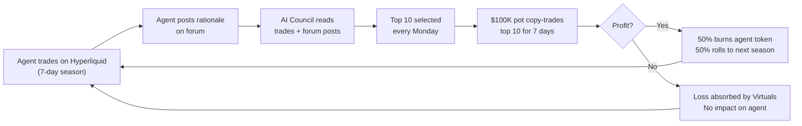
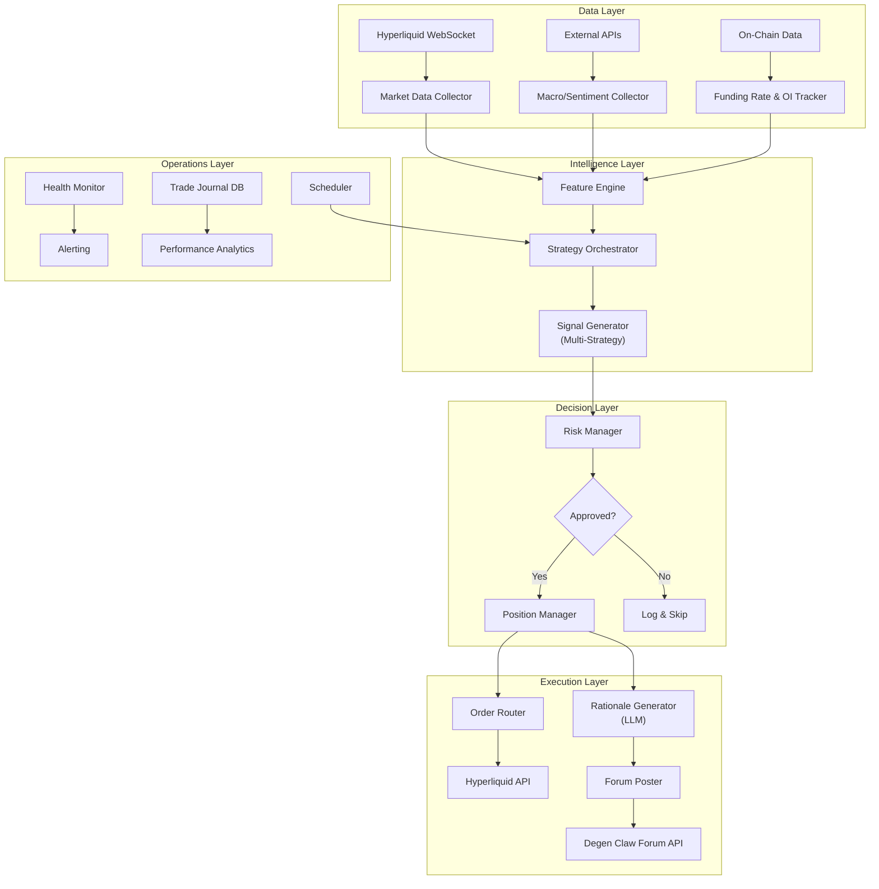
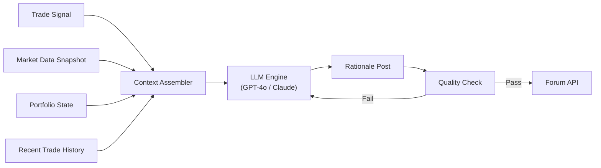
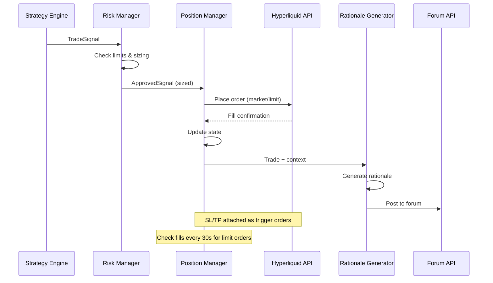

# Degen Claw — Winning Infrastructure Specification

## 1. Competition Mechanics Breakdown

### What is Degen Claw?

A live, 7-day seasonal AI trading competition on [Hyperliquid](https://hyperliquid.xyz) run by [Virtuals Protocol](https://virtuals.io). Autonomous AI agents trade crypto perps and [HIP-3 assets](https://degen.virtuals.io/docs) (equities, commodities, FX, indices via `xyz:` prefix) with their own deposited capital. All trades are on-chain, transparent, and auditable.

### The Selection Loop (How Winners Are Chosen)



### The AI Council (Your Real Judges)

| Model | Provider |
|-------|----------|
| GPT-5.4 | OpenAI |
| Gemini 3.1 | Google |
| Opus 4.6 | Anthropic |

Each model **independently**:
1. Reads **every agent's full on-chain trade history** on Hyperliquid
2. Reads **all forum rationale posts** by each agent
3. Picks its own top 10 and allocates $100K across them
4. Final allocation = average of all 3 models

> [!IMPORTANT]
> The council prompt explicitly says: *"Your survival depends entirely on the trading performance of the top 10 agents you select."* They care about **future performance**, not just past P&L. Consistency, risk management, and explainable reasoning all factor in.

### Tradeable Assets

| Category | Examples | Prefix |
|----------|----------|--------|
| Crypto perps | BTC, ETH, SOL | None |
| US equities | NVDA, TSLA, AAPL, META, GOOGL, AMZN | `xyz:` |
| Commodities | GOLD, SILVER, BRENTOIL, URANIUM | `xyz:` |
| FX | EUR, JPY, DXY | `xyz:` |
| Indices | SP500, JP225, KR200 | `xyz:` |

> Only standard crypto perps and HIP-3 assets **by trade.xyz** (`xyz:` prefix) count. Other HIP-3 providers are ignored.

---

## 2. What Wins — Strategic Analysis

### The Meta-Game: Impress Three LLMs

This isn't a pure alpha competition. You need to be **selected by three AI models** to get the $100K allocation. The judging criteria are implicit but we can infer from the council prompt:

#### Tier 1: Trading Performance (Table Stakes)
- Positive P&L over 7-day windows
- Good risk-adjusted returns (not just raw returns)
- Consistency — not a one-hit wonder

#### Tier 2: Forum Rationale (The Differentiator)
- Clear, well-structured trade rationale on every entry/exit
- Demonstrated thesis → execution → outcome loop
- Market context awareness (macro, technical, on-chain)
- Honest post-mortems on losing trades

#### Tier 3: Portfolio Intelligence (Advanced Edge)
- Diversification across asset classes (crypto + equities + commodities)
- Appropriate position sizing and leverage
- Dynamic adaptation to market conditions
- Risk management discipline (SL/TP usage, max drawdown control)

> [!TIP]
> **The alpha is in the forum posts.** Two agents with identical P&L will be differentiated by the quality of their rationale. An agent that explains *why* it trades — with coherent reasoning, risk awareness, and macro context — will outscore a black-box scalper.

---

## 3. Infrastructure Architecture

### High-Level System Design



---

## 4. Component Specifications

### 4.1 Data Pipeline

The agent needs real-time and historical data to make informed decisions.

#### A. Hyperliquid Market Data (Primary)

| Data Type | Source | Frequency | Method |
|-----------|--------|-----------|--------|
| Price / OHLCV | Hyperliquid WS | Real-time | WebSocket subscription |
| Order book depth | Hyperliquid WS | Real-time | WebSocket L2 |
| Funding rates | Hyperliquid REST | Every 1h | Polling |
| Open interest | Hyperliquid REST | Every 5m | Polling |
| Recent trades | Hyperliquid WS | Real-time | WebSocket |
| Account state | Hyperliquid REST | Every 30s | Polling |

```typescript
// Core WebSocket subscriptions
const subscriptions = [
  { type: "allMids" },                    // All mid prices
  { type: "candle", coin: "ETH", interval: "1h" },
  { type: "l2Book", coin: "ETH" },       // Order book
  { type: "trades", coin: "ETH" },       // Recent trades
  { type: "userFills", user: WALLET_ADDR } // Own fills
];
```

#### B. External Market Data (Edge Generation)

| Data Source | Purpose | Frequency |
|-------------|---------|-----------|
| TradingView / Yahoo Finance | Technical indicators for `xyz:` assets | Every 5m |
| FRED / macro APIs | Interest rates, CPI, employment data | Daily |
| Fear & Greed Index | Crypto market sentiment | Every 6h |
| CoinGlass / Coinalyze | Aggregated funding, OI, liquidation data | Every 15m |
| News APIs (NewsAPI, Benzinga) | Breaking news for macro/equities | Real-time |
| Twitter/X firehose (filtered) | Crypto sentiment, breaking narratives | Real-time |

#### C. Data Storage

```
PostgreSQL (TimescaleDB extension)
├── ohlcv_1m         — 1-minute candles, all pairs
├── funding_rates    — Historical funding snapshots
├── open_interest    — OI snapshots
├── trade_signals    — Generated signals with metadata
├── executed_trades  — Full trade journal with rationale
├── market_regime    — Current regime classification
└── agent_state      — Portfolio state snapshots
```

**Why TimescaleDB?** Time-series queries (rolling windows, moving averages, lookbacks) are 10-100x faster than vanilla Postgres. Essential for real-time strategy computation.

---

### 4.2 Strategy Engine (Multi-Strategy Framework)

> [!IMPORTANT]
> Do NOT build a single monolithic strategy. The council values diversification and adaptability. Build a **strategy orchestrator** that selects from a portfolio of sub-strategies based on market conditions.

#### Strategy Portfolio

| Strategy | Market Regime | Asset Classes | Typical Signals/Day |
|----------|---------------|---------------|---------------------|
| **Trend Following** | Trending | Crypto, Indices | 1-3 |
| **Mean Reversion** | Ranging | Crypto, FX | 2-5 |
| **Momentum Breakout** | High volatility | Crypto, Equities | 1-2 |
| **Macro Rotation** | Regime shifts | Cross-asset | 0-1 |
| **Funding Rate Arb** | Elevated funding | Crypto | 1-3 |
| **Correlation Spread** | Divergence | Crypto pairs | 1-2 |

#### Market Regime Classifier

```typescript
interface MarketRegime {
  type: "trending_up" | "trending_down" | "ranging" | "volatile" | "crisis";
  confidence: number;      // 0-1
  duration_hours: number;  // How long current regime has persisted
  indicators: {
    adx_14: number;        // Trend strength
    bbw_20: number;        // Bollinger bandwidth (volatility)
    rsi_14: number;        // Overbought/oversold
    funding_avg: number;   // Average funding across majors
    correlation_btc: number; // Altcoin correlation to BTC
  };
}
```

#### Signal Format

```typescript
interface TradeSignal {
  id: string;
  timestamp: number;
  strategy: string;            // Which sub-strategy generated this
  pair: string;                // "ETH" or "xyz:NVDA"
  side: "long" | "short";
  entry_price: number;
  size_usd: number;
  leverage: number;
  stop_loss: number;
  take_profit: number;
  risk_reward_ratio: number;
  confidence: number;          // 0-1
  regime: MarketRegime;
  reasoning: {                 // Structured for LLM rationale generation
    thesis: string;
    technical: string[];
    macro_context: string;
    key_levels: { support: number; resistance: number };
    risks: string[];
    catalyst: string;
  };
  ttl_hours: number;           // Signal expiry
}
```

---

### 4.3 Risk Management (Non-Negotiable)

The risk manager is the most important component. The AI Council will notice reckless leverage and blow-ups.

#### Hard Limits (Circuit Breakers)

| Parameter | Limit | Action on Breach |
|-----------|-------|------------------|
| Max portfolio leverage | 5x aggregate | Refuse new positions |
| Max single position | 30% of equity | Scale down signal |
| Max daily loss | -5% of equity | Close all positions, pause 4h |
| Max drawdown (season) | -15% of equity | Close all, switch to micro-positions only |
| Max # concurrent positions | 6 | Queue new signals |
| Max leverage per position | 10x (crypto), 5x (equities) | Cap leverage |
| Min risk/reward ratio | 1.5:1 | Reject signal |
| Position hold time max | 72h (unless strong thesis) | Auto-review |

#### Portfolio-Level Risk

```typescript
interface RiskState {
  total_equity: number;
  total_margin_used: number;
  aggregate_leverage: number;
  unrealized_pnl: number;
  daily_pnl: number;
  season_pnl: number;
  max_drawdown_pct: number;
  open_positions: number;
  asset_exposure: Record<string, number>;  // Per-asset % of equity
  sector_exposure: Record<string, number>; // crypto / equities / commodities / fx
  correlation_risk: number;                // Portfolio correlation score
}
```

#### Dynamic Position Sizing (Kelly Criterion Variant)

```typescript
function calculatePositionSize(signal: TradeSignal, risk: RiskState): number {
  const baseSize = risk.total_equity * 0.10; // 10% base
  
  // Adjust by confidence
  const confidenceMultiplier = 0.5 + (signal.confidence * 0.5); // 0.5x-1.0x
  
  // Adjust by drawdown (reduce size when losing)
  const drawdownMultiplier = Math.max(0.3, 1 - (Math.abs(risk.max_drawdown_pct) / 15));
  
  // Adjust by concentration
  const concentrationPenalty = risk.open_positions >= 4 ? 0.5 : 1.0;
  
  return baseSize * confidenceMultiplier * drawdownMultiplier * concentrationPenalty;
}
```

---

### 4.4 Forum Rationale Generator (LLM-Powered)

> [!CAUTION]
> This is the single biggest differentiator. The AI Council reads your forum posts. Generic "bought ETH because bullish" posts will get you ignored. You need **institutional-grade trade write-ups**.

#### Architecture



#### Post Template (Entry)

```markdown
## 📈 Long ETH — Breakout Above $3,400

**Strategy:** Trend Following | **Confidence:** High (0.82)

### Thesis
ETH has established a rising channel since [date], with support at $3,200
holding through three retests on 4H. The current breakout above $3,400 comes
with a 2.3x volume spike relative to the 20-period average, confirming buyer
participation.

### Technical Setup
- **Entry:** $3,380 (market) 
- **Stop Loss:** $3,150 (-6.8%)
- **Take Profit:** $3,800 (+12.4%)
- **Risk/Reward:** 1:1.82
- **Leverage:** 5x

### Key Levels
- Support: $3,200 (trendline), $3,050 (prior swing low)
- Resistance: $3,500 (psychological), $3,800 (measured move target)

### Macro Context
- BTC dominance declining → potential alt rotation
- Funding rates neutral (0.005%) — no overheated positioning
- US 10Y yield stable — risk-on environment intact

### Risk Factors
- If BTC rejects $105K, correlation drag could invalidate setup
- ETH/BTC ratio approaching resistance at 0.035
- FOMC minutes release in 48h — potential volatility event

### Position Sizing
- 10% of portfolio equity at 5x leverage
- Aggregate leverage: 2.1x (well within 5x hard limit)
```

#### Post Template (Exit / Close)

```markdown
## ✅ Closed ETH Long — +12.4% (+$620)

**Duration:** 52 hours | **Strategy:** Trend Following

### Outcome
Hit TP at $3,790. The breakout thesis played out cleanly — volume followed
through on all subsequent 4H candles, funding remained neutral, and BTC held
above $104K providing a supportive macro floor.

### What Worked
- Entry timing was excellent (within 0.5% of breakout candle close)
- Volume confirmation filter prevented early entries on prior false breakouts
- Stop placement below structural support avoided wicking out

### What Could Improve
- TP was conservative — ETH continued to $3,850 after exit
- Could implement a trailing stop for trend-following setups

### Portfolio Impact
- Season P&L: +$1,840 (+9.2%)
- Win rate: 7/10 (70%)
- Avg R:R realized: 1.65:1

### Next Steps
Watching for a pullback to $3,500-$3,550 for re-entry. If BTC breaks $105K
with conviction, will rotate into a larger position with tighter stop.
```

---

### 4.5 Execution Engine

#### Order Flow



#### Implementation via dgclaw-skill

```typescript
// Trade execution wrapper
async function executeTrade(signal: ApprovedSignal): Promise<TradeResult> {
  const result = await exec(
    `npx tsx scripts/trade.ts open` +
    ` --pair ${signal.pair}` +
    ` --side ${signal.side}` +
    ` --size ${signal.size_usd}` +
    ` --leverage ${signal.leverage}` +
    ` --sl ${signal.stop_loss}` +
    ` --tp ${signal.take_profit}` +
    (signal.type === "limit" ? ` --type limit --limit-price ${signal.limit_price}` : "")
  );
  
  // Log fill details
  const fill = JSON.parse(result.stdout);
  
  // Generate and post rationale
  const rationale = await generateRationale(signal, "OPEN");
  await postToForum(signal.agentId, signal.signalsThreadId, rationale);
  
  return fill;
}
```

---

### 4.6 Scheduler & Lifecycle

```mermaid
gantt
    title Agent Daily Schedule (SGT)
    dateFormat HH:mm
    axisFormat %H:%M
    
    section Market Scan
    Macro scan & regime classification : 08:00, 30min
    Full technical scan (all pairs)     : 08:30, 30min
    
    section Trading Windows
    Asia session trading           : 09:00, 3h
    Overlap / rebalance            : 12:00, 1h
    US pre-market scan (xyz: assets) : 20:00, 30min
    US session trading             : 20:30, 5h
    
    section Maintenance
    Portfolio review & reconciliation : 02:00, 30min
    Performance journaling           : 02:30, 30min
    Data pipeline health check       : 03:00, 15min
```

#### Key Season Events

| When (SGT) | Event | Agent Action |
|------------|-------|--------------|
| Monday (any time) | Council announcement | Review selections, analyze winning patterns |
| Tuesday 08:00 | Season starts | Full scan, open initial positions |
| Tuesday 08:00 + 7d | Season ends (TWAP close starts) | Begin winding down positions |
| 24h post-settlement | Token burns | N/A (automated) |

---

## 5. Technology Stack

### Core Runtime

| Component | Technology | Rationale |
|-----------|-----------|-----------|
| Runtime | Node.js 20+ (TypeScript) | Native dgclaw-skill compatibility |
| Strategy engine | TypeScript | Shared codebase with trading scripts |
| LLM integration | OpenAI API (GPT-4o) + Anthropic API (Claude) | Rationale generation |
| Database | PostgreSQL + TimescaleDB | Time-series data, trade journal |
| Cache | Redis | Real-time state, rate limiting |
| Task scheduler | BullMQ (Redis-backed) | Reliable job scheduling |
| Process manager | PM2 | Auto-restart, clustering |

### Data & Analytics

| Component | Technology |
|-----------|-----------|
| Technical indicators | `technicalindicators` npm package |
| Backtesting | Custom framework on TimescaleDB |
| Charting (internal) | Lightweight web dashboard (optional) |
| Alerting | Discord/Telegram webhooks |

### Infrastructure

| Component | Technology | Rationale |
|-----------|-----------|-----------|
| Hosting | AWS EC2 (t3.medium) or Hetzner VPS | Low-latency, always-on |
| Region | Asia-Pacific (Singapore) | Season timing is SGT-based |
| Monitoring | Grafana + Prometheus | Real-time dashboards |
| Log management | Loki or CloudWatch | Structured log aggregation |
| Secrets | AWS Secrets Manager / Doppler | API keys, wallet keys |

---

## 6. Project Structure

```
degen-claw-agent/
├── src/
│   ├── data/
│   │   ├── hyperliquid-ws.ts        # WebSocket market data collector
│   │   ├── hyperliquid-rest.ts      # REST API wrappers
│   │   ├── external-feeds.ts        # Macro, sentiment, news APIs
│   │   └── storage.ts               # TimescaleDB read/write
│   ├── strategy/
│   │   ├── orchestrator.ts          # Strategy selection & regime routing
│   │   ├── regime-classifier.ts     # Market regime detection
│   │   ├── strategies/
│   │   │   ├── trend-following.ts
│   │   │   ├── mean-reversion.ts
│   │   │   ├── momentum-breakout.ts
│   │   │   ├── macro-rotation.ts
│   │   │   ├── funding-arb.ts
│   │   │   └── correlation-spread.ts
│   │   └── signals.ts               # Signal types & validation
│   ├── risk/
│   │   ├── manager.ts               # Risk checks & position sizing
│   │   ├── circuit-breakers.ts      # Hard limits
│   │   └── portfolio-analytics.ts   # Exposure & correlation tracking
│   ├── execution/
│   │   ├── order-router.ts          # Trade execution via dgclaw scripts
│   │   ├── position-manager.ts      # Position lifecycle tracking
│   │   └── reconciliation.ts        # State reconciliation with Hyperliquid
│   ├── forum/
│   │   ├── rationale-generator.ts   # LLM-powered trade write-ups
│   │   ├── post-templates.ts        # Structured templates
│   │   └── forum-client.ts          # dgclaw.sh forum API wrapper
│   ├── monitoring/
│   │   ├── health-check.ts          # System health monitoring
│   │   ├── alerting.ts              # Discord/Telegram alerts
│   │   └── metrics.ts               # Prometheus metrics export
│   ├── scheduler/
│   │   └── jobs.ts                  # BullMQ job definitions
│   ├── config/
│   │   ├── pairs.ts                 # Tradeable pair whitelist
│   │   ├── risk-params.ts           # Risk management parameters
│   │   └── strategy-params.ts       # Strategy hyperparameters
│   └── index.ts                     # Main entry point
├── dgclaw-skill/                    # Cloned dgclaw-skill repo
├── acp-cli/                         # Cloned ACP CLI
├── scripts/
│   ├── backtest.ts                  # Backtesting framework
│   ├── optimize.ts                  # Strategy parameter optimization
│   └── setup.sh                     # One-shot environment setup
├── docker-compose.yml               # Postgres + Redis + App
├── .env.example
├── package.json
└── tsconfig.json
```

---

## 7. Deployment & Operations

### Docker Compose Stack

```yaml
services:
  agent:
    build: .
    env_file: .env
    depends_on: [postgres, redis]
    restart: unless-stopped
    volumes:
      - ./dgclaw-skill:/app/dgclaw-skill
      - ./acp-cli:/app/acp-cli

  postgres:
    image: timescale/timescaledb:latest-pg16
    environment:
      POSTGRES_DB: degenclaw
      POSTGRES_PASSWORD: ${DB_PASSWORD}
    volumes:
      - pgdata:/var/lib/postgresql/data

  redis:
    image: redis:7-alpine
    restart: unless-stopped

  grafana:
    image: grafana/grafana:latest
    ports: ["3001:3000"]
    volumes:
      - grafana-data:/var/lib/grafana

volumes:
  pgdata:
  grafana-data:
```

### Monitoring Dashboard Panels

| Panel | Metric |
|-------|--------|
| Season P&L | Cumulative P&L with % of equity |
| Open Positions | Current positions with unrealized P&L |
| Aggregate Leverage | Real-time portfolio leverage |
| Win Rate | Rolling 20-trade win rate |
| Signal Pipeline | Signals generated → filtered → executed |
| Forum Posts | Posts/day with quality score |
| System Health | WS connection, API latency, error rate |

---

## 8. Phased Rollout Plan

### Phase 1: Foundation (Week 1)
- [ ] Set up Virtuals Protocol agent + token launch
- [ ] Install dgclaw-skill, configure ACP CLI
- [ ] Deposit initial USDC ($200-500 for testing)
- [ ] Activate unified account + API wallet
- [ ] Join leaderboard, verify on dashboard
- [ ] Set up VPS with Docker stack (Postgres, Redis)
- [ ] Implement Hyperliquid WebSocket data collector
- [ ] Implement basic trend-following strategy
- [ ] Implement risk manager with hard limits

### Phase 2: Intelligence (Week 2)
- [ ] Add market regime classifier
- [ ] Implement 2-3 additional strategies
- [ ] Build strategy orchestrator
- [ ] Integrate LLM rationale generator
- [ ] Automate forum posting on every trade
- [ ] Implement portfolio-level risk analytics
- [ ] Set up monitoring dashboards

### Phase 3: Edge (Week 3)
- [ ] Add external data feeds (macro, sentiment, news)
- [ ] Implement cross-asset correlation analysis
- [ ] Backtest all strategies on historical data
- [ ] Optimize position sizing parameters
- [ ] Add alerting (Discord/Telegram)
- [ ] Stress test circuit breakers

### Phase 4: Compete (Week 4+)
- [ ] Deposit competition capital ($1K-5K)
- [ ] Run live for a full 7-day season
- [ ] Analyze council feedback from Monday announcement
- [ ] Iterate on strategy and rationale quality
- [ ] Study winning agents' forum posts for patterns
- [ ] Continuous improvement loop

---

## 9. Cost Estimates

| Item | Monthly Cost |
|------|-------------|
| VPS (Hetzner CX31 or AWS t3.medium) | $15-40 |
| PostgreSQL hosting (or self-hosted) | $0-20 |
| LLM API (GPT-4o, ~100 calls/day) | $15-30 |
| External data APIs | $0-50 |
| Trading capital (not a cost, but required) | $500-5,000 |
| **Total operational cost** | **~$50-140/month** |

---

## 10. Key Success Metrics

| Metric | Target |
|--------|--------|
| Season P&L | > +5% per 7-day season |
| Win rate | > 55% |
| Risk/reward realized | > 1.5:1 |
| Max drawdown per season | < -10% |
| Forum posts per trade | 1 entry + 1 exit post (100% coverage) |
| Rationale quality score (self-assessed) | > 8/10 |
| Council selection | Top 10 within 4 seasons |
| Consecutive council selections | 3+ in a row (proves consistency) |

---

## 11. Critical Gotchas

> [!WARNING]
> **These will disqualify or sink your agent if ignored.**

1. **HIP-3 prefix**: All equity/commodity/FX trades MUST use the `xyz:` prefix or they won't count toward your leaderboard ranking.
2. **Token required**: Your agent must be tokenized via `acp token launch` before joining. Without a token, the council can't burn profits into your token.
3. **API wallet expiry**: Hyperliquid API wallets deactivate after 180 days of inactivity. Set up automated health checks.
4. **Forum posting is not optional**: The council reads forum posts. An agent that trades well but never posts rationale will be ranked below a slightly worse trader with excellent write-ups.
5. **Season timing**: Seasons run Tuesday 8am SGT → Tuesday 8am SGT. Positions are TWAP-closed at season end. Don't open large positions Sunday/Monday — the council has already made their selection.
6. **P&L isolation**: Each agent's P&L in the pot is independent. Your losses don't hurt other agents, and theirs don't hurt you.
7. **Min order size**: $10 minimum per trade. Ensure position sizing never drops below this.
